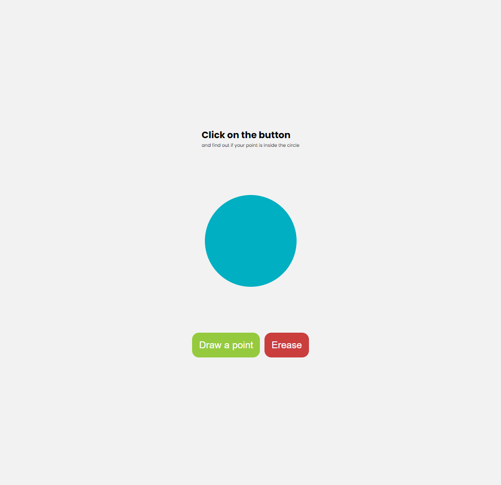
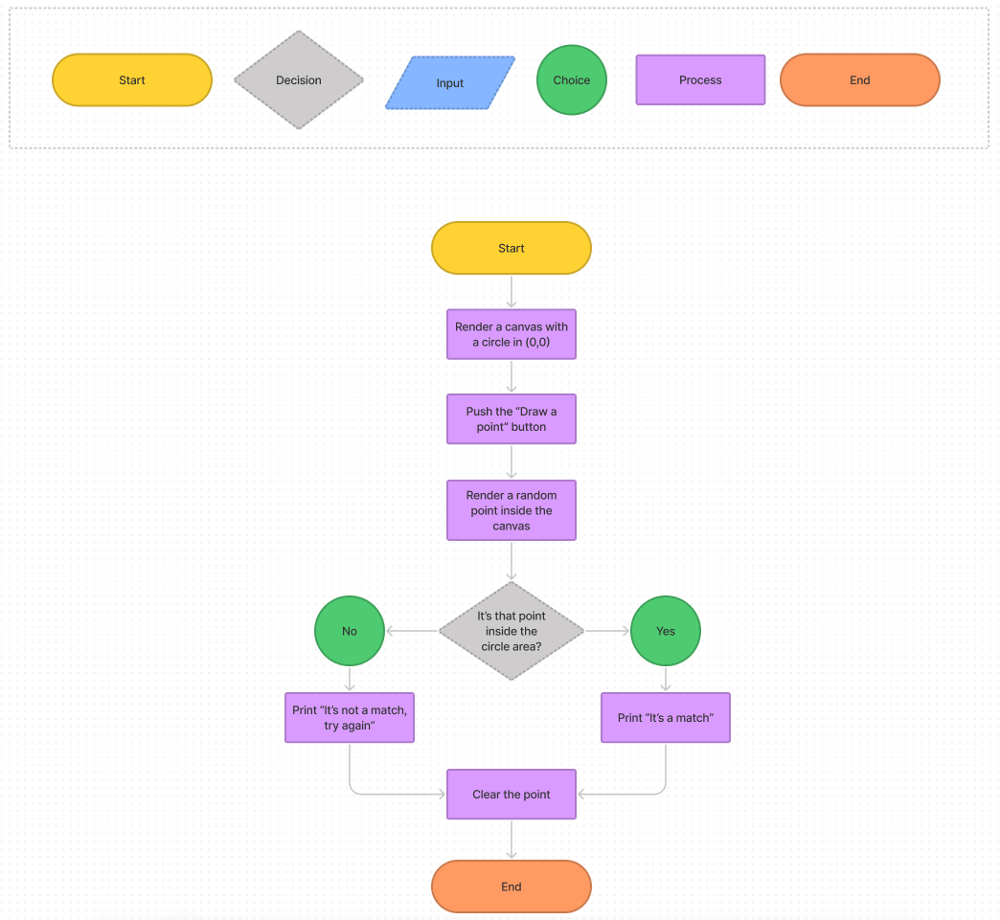

# Draw a point

JavaScript challenge. Generate a random point on the canvas and find out wether it's inside the circle

## Table of contents

- [Overview](#overview)
  - [The challenge](#the-challenge)
  - [Screenshot](#screenshot)
  - [Links](#links)
- [My process](#my-process)
  - [Built with](#built-with)
  - [What I learned](#what-i-learned)
- [Author](#author)

## Overview

### The challenge

Users should be able to:

- Create a random point for everytime they click on the button "Draw"
- Get a message telling them if their point is inside the circle
- Clear the board

### Screenshot

  
💻 Desktop

  

### Links

- Live Site URL: [Draw a point](https://themattfire.github.io/Exercise_draw-a-point/)

## My process

### Built with

- JavaScript

An initial diagram was made to understand the process

  <summary💡 Diagram

  

### What I learned

I practice using canvas and learning about it's methods. I also practiced my knowledge on showing messages to the users with createElement.

## Author

- Github - [@themattfire](github.com/themattfire)
